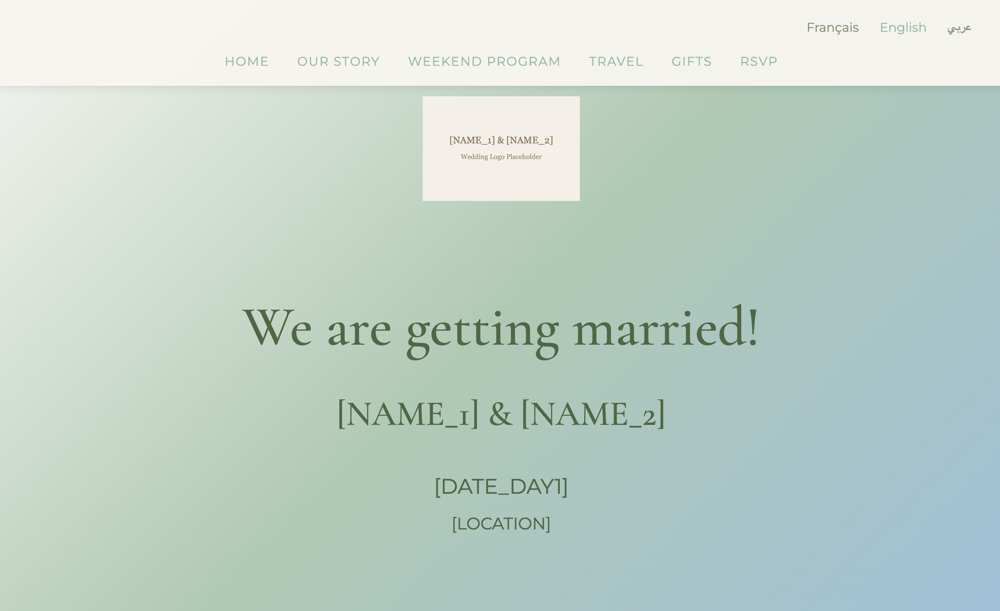
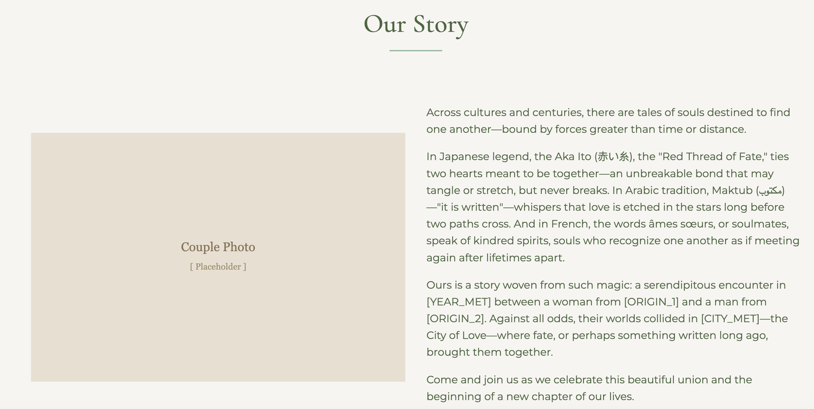
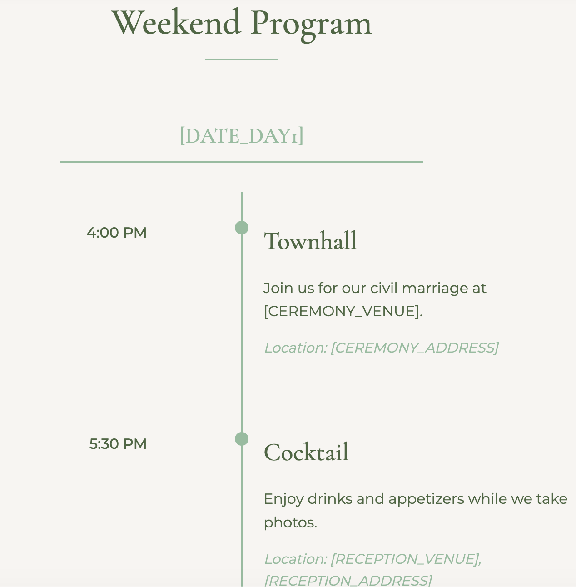

# Wedding Website





A static multilingual wedding website for a Lebanese-French multicultural wedding, built as a vibe-coded portfolio project.

> **Vibe-coded:** This website was built with AI-assisted development (Claude). The design, structure, translations, and RTL support were all generated and iterated through conversational prompting — no manual boilerplate, no framework scaffolding. It is an example of what vibe coding can produce for a real, production-used project.

## Features

- **Multilingual:** English, French, and Arabic with full RTL layout support
- **Zero dependencies:** Pure vanilla HTML, CSS, and JavaScript — no build step, no npm
- **i18n system:** All copy lives in `locales/*.json`; `data-i18n` attributes wire it to the DOM
- **Dual-heritage design:** Lebanese and French cultural elements (cedar, Eiffel tower, Norman apple) woven into the visual identity
- **Responsive:** Works on mobile, tablet, and desktop
- **Privacy-aware:** `robots.txt` and meta tags prevent search engine indexing

## Privacy notice

All personal information has been replaced with typed placeholders so this code is safe to study and fork:

| Token | Stands for |
|---|---|
| `[NAME_1]`, `[NAME_2]` | The couple's names |
| `[DATE_DAY1]`, `[DATE_DAY2]` | Wedding dates |
| `[RSVP_DEADLINE]` | RSVP cut-off date |
| `[LOCATION]` | Wedding region |
| `[CEREMONY_VENUE]`, `[CEREMONY_ADDRESS]` | Civil ceremony venue and address |
| `[RECEPTION_VENUE]`, `[RECEPTION_ADDRESS]` | Reception venue and address |
| `[TRAIN_STATION_CEREMONY]` | Closest train station to the ceremony venue |
| `[TAXI_NAME]`, `[TAXI_PHONE]` | Local taxi service |
| `[ORIGIN_1]`, `[ORIGIN_2]` | Partners' home regions |
| `[CITY_MET]` | City where they met |
| `[YEAR_MET]` | Year they met |
| `[HONEYMOON_DESTINATION]` | Honeymoon country |
| `[RSVP_FORM_URL]`, `[RSVP_FORM_EMBED]` | Google Forms RSVP link and embed |
| `[MAP_EMBED]` | Google Maps iframe |

Photos of the couple and honeymoon destination have been replaced with SVG placeholders.

## Project structure

```
.
├── index.html                  # Single-page app entry point
├── css/
│   ├── styles.css              # Main styles and CSS custom properties
│   ├── cultural-elements.css   # Cultural icon and decorative styles
│   └── rtl.css                 # Right-to-left overrides for Arabic
├── js/
│   ├── main.js                 # App logic, language switching, RSVP
│   └── translations.js         # i18n engine
├── locales/
│   ├── en.json                 # English translations
│   ├── fr.json                 # French translations
│   └── ar.json                 # Arabic translations
├── assets/
│   └── images/                 # Wedding logo and cultural SVG icons
└── robots.txt                  # Blocks all search engine crawlers
```

## Run locally

No build step required — open the file directly or serve it:

```bash
# Option 1: open directly
open index.html

# Option 2: Python built-in server
python -m http.server 8000
# visit http://localhost:8000

# Option 3: Node
npx http-server .
```

Test all three language tabs and verify the Arabic RTL layout flips correctly.

## Development notes

- Add translation keys to all three `locales/*.json` files
- Use `data-i18n="key"` on elements for text, `data-i18n-alt="key"` for `alt` attributes
- CSS custom properties (`:root`) control the color palette and typography
- RTL support is loaded as a separate stylesheet toggled by `js/main.js`

## License

MIT
